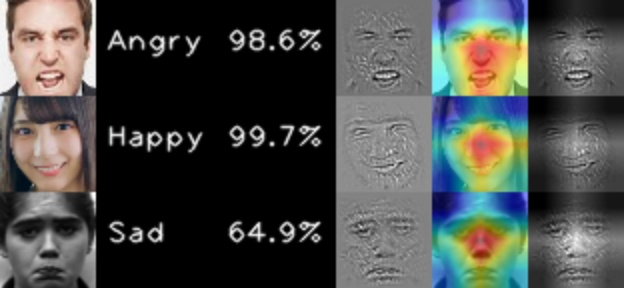

# facial-expression-recognition-web

* Pytorch implementation for [Mini Xception](https://arxiv.org/pdf/1710.07557.pdf)
* Author's original Keras implementation is [here](https://github.com/oarriaga/face_classification)
* you can use as [ONNX](https://github.com/Microsoft/onnxjs)

## Trained Model

Trained by FER2013 dataset.

* Private Data : 65%
* Public Data : 64%

Here is the sample image's `Emotion`, `Prob`, `GradCam`, `Guided BackProp` and `Guided GradCam`



You can try real time FER on WEB browser.
```
cd example
http-server 8000
```

open `http://localhost:8000`

## Retrain

```
cd src
python train.py
```